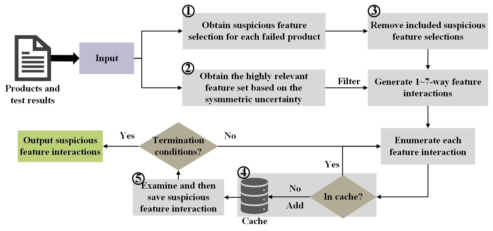

# CRFL

## A Low-Cost Feature Interaction Fault Localization Approach for Software Product Lines

###Overview
Counterfactual Reasoning based Fault Localization (CRFL) is a low-cost approach for feature interaction faults of SPLs. CRFL has less dependency on the platform and libraries used, both Linux and Windows systems can use it normally.



### How to run CRFL?
We evaluate the performance of CRFL and the baselines using eight software product lines. The BerkeleyDB and TankWar, consist of multiple variability bug cases generated to assess the method’s capability to handle large-scale product lines. As the size of the dataset is too large, we put a part of the dataset in the folder . /examples for running our experiments. You can download a complete data versions of  other datasets at [here](https://tuanngokien.github.io/splc2021/). 

After preparing the data, set the system_name and buggy_systems_folder parameters in ObtainSusFeatureInteractions.py to execute the script directly. You can run it using the command line, for example:

```sh
python ObtainSusFeatureInteractions.py --RQ1 --RQ3 --system "BankAccountTP" --buggy_systems_folder "./examples/4-wise-BankAccountTP-1BUG-Full"
```

The meaning of arguments are as following:
1. **system**: For example Email, GPL, or BerkeleyDB, etc
2. **buggy_systems_folder**: The path of the folder where you place the buggy versions of the systems, e.g. /Users/whn/SPLSystems/Email/1Bug/4wise/
3. **RQ1**: Controls whether RQ1 and RQ2 are executed, with a default setting of True.
4. **RQ3**: Controls whether RQ3 is executed, with a default setting of True.

All experimental results are stored in the ./experiment_results folder. For each case, suspicious feature interactions are recorded in the spc_10.log file within the respective case directory.

